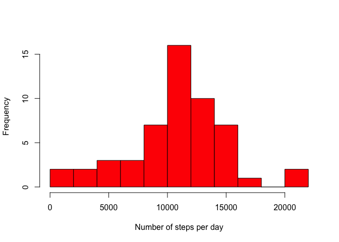
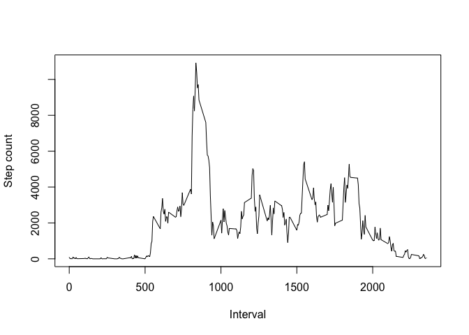
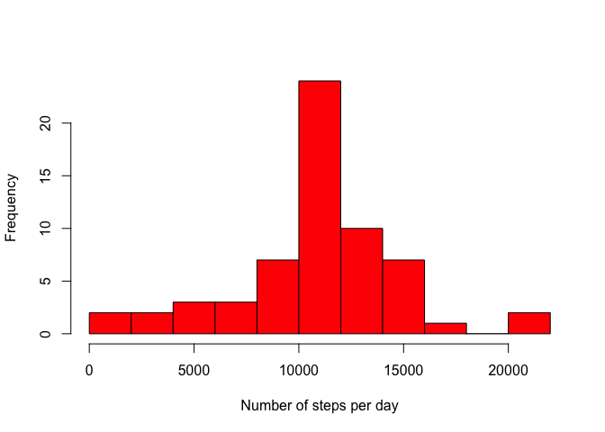
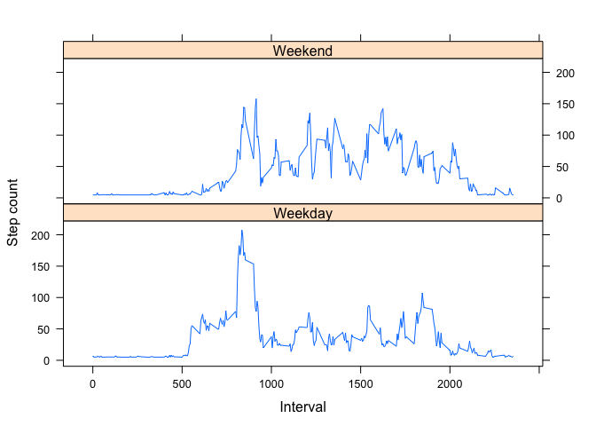

## Loading and preprocessing the data


```r
library(data.table)
library(ggplot2)
library(lattice)

setwd("/Users/j.wagg/DataScience/Course5/")
activity <- read.csv(file="activity.csv", header=TRUE, sep=",")
apply(activity,2,max,na.rm=TRUE)
```

```
##        steps         date     interval 
##        "806" "2012-11-30"       "2355"
```

```r
act <- na.omit(activity)
```

## What is mean total number of steps taken per day?

First, create a new data frame with the total number of steps calculated for each unique day:


```r
act <- data.table(act)
totsteps <- as.data.frame(act[, list(total = sum(steps)), by = c("date")])
```

Now, plot a histogram of the frequency with which each total number of steps occurs:


```r
hist(totsteps$total, breaks=12, col="red",xlab="Number of steps per day",ylab="Frequency",main="")
```

<!-- -->

And finally, we print the mean and median number of steps which occur on each day:


```r
meansteps <- mean(totsteps$total,na.rm = TRUE)
medsteps <- median(totsteps$total,na.rm=TRUE)

print(c("Mean number of steps",meansteps))
```

```
## [1] "Mean number of steps" "10766.1886792453"
```

```r
print(c("Median number of steps",medsteps))
```

```
## [1] "Median number of steps" "10765"
```

## What is the average daily activity pattern?

Plot a time series of the total number of steps as a function of interval:


```r
intsteps <- as.data.frame(act[, list(total = sum(steps)), by = c("interval")])
plot(intsteps$interval,intsteps$total,type="l",ylab="Step count",xlab="Interval")
```

<!-- -->

Now, find the index of the interval with the maximum number of steps, and print this along with the maximum number. 


```r
indmax <- which.max(intsteps$total)
maxint <- intsteps$total[indmax]
print(c("Maximum step count is ",maxint," at index ",indmax))
```

```
## [1] "Maximum step count is " "10927"                 
## [3] " at index "             "104"
```

## Inputting missing values

The following code calculates the total number of 'NAs' in the dataset and replaces each with the mean value of column:


```r
totNA <- sum(is.na(activity))
print(c("Total number of NAs:",totNA))
```

```
## [1] "Total number of NAs:" "2304"
```

```r
for (i in 1:nrow(activity)){
  if (is.na(activity$steps[i])){
    activity$steps[i] <- mean(activity$steps,na.rm=TRUE)
  }
  if (is.na(activity$interval[i])){
    activity$interval[i] <- mean(activity$interval,na.rm=TRUE)
  }
}
```

Now, we replot the histogram of the total number of steps, now with the NAs replaced by real values:


```r
act2 <- data.table(na.omit(activity))
totsteps2 <- as.data.frame(act2[, list(total = sum(steps)), by = c("date")])
hist(totsteps2$total, breaks=12, col="red",xlab="Number of steps per day",ylab="Frequency",main="")
```

<!-- -->

Finally, we calculate the mean and median number of steps for the new data set:


```r
meansteps2 <- mean(totsteps2$total,na.rm = TRUE)
medsteps2 <- median(totsteps2$total,na.rm=TRUE)
print(c("Mean number of steps",meansteps2))
```

```
## [1] "Mean number of steps" "10766.1886792453"
```

```r
print(c("Median number of steps",medsteps2))
```

```
## [1] "Median number of steps" "10766.1886792453"
```


## Are there differences in activity patterns between weekdays and weekends?

To begin, we create a new factor variable with two levels, 'weekday' and 'weekend':


```r
days <- weekdays(as.Date(activity$date))
level <- vector()
for (i in 1:nrow(activity)) {
  if (days[i] == "Sunday") {
    level[i] <- "Weekend"
  } else if (days[i] == "Saturday") {
    level[i] <- "Weekend"
  } else {
    level[i] <- "Weekday"
  }
}
activity$level <- factor(level)
newsteps <- aggregate(steps ~ interval + level, data = activity, mean)
names(newsteps) <- c("interval", "level", "steps")
```

And to conclude, we create two time series plots showing the number of steps as a function of interval on weekdays and weekends: 


```r
xyplot(steps ~ interval | level, newsteps, type = "l",xlab = "Interval", ylab = "Step count",
       layout=c(1,2))
```

<!-- -->
